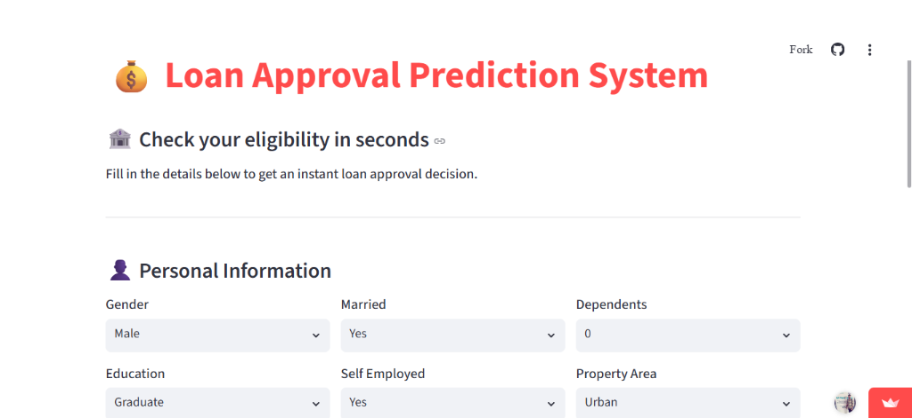
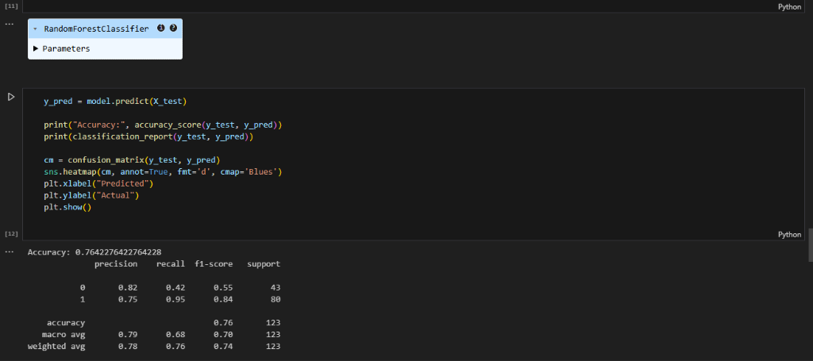

# 💰 Loan Approval Prediction System

A comprehensive Machine Learning application designed to predict loan eligibility based on customer details. This project includes a data analysis pipeline, model training, and a user-friendly web interface built with Streamlit.

## 🚀 Overview

The **Loan Approval Prediction System** automates the process of determining whether a loan application should be approved or rejected. It evaluates various factors such as applicant income, credit history, education, and property area to provide an instant decision.

### Key Features
- **Instant Prediction:** Get real-time loan approval status.
- **Interactive UI:** A vibrant and user-friendly interface powered by Streamlit.
- **Affordability Analysis:** Calculates EMI and evaluates eligibility based on income-to-loan ratios.
- **Smart Logic for Freshers:** Special handling for applicants with no credit history.
- **Data-Driven Insights:** Built on a Random Forest Classifier trained on historical loan data.

---

## 📸 Screenshots

### Web Application Interface

*Figure 1: The interactive dashboard for checking loan eligibility.*

### Model Performance

*Figure 2: Classification report and confusion matrix from the model training phase.*

---

## 🛠️ Technology Stack

- **Data Processing:** Pandas, NumPy
- **Machine Learning:** Scikit-learn (Random Forest Classifier)
- **Visualization:** Seaborn, Matplotlib
- **Web Framework:** Streamlit
- **Model Storage:** Joblib

---

## 📂 Project Structure

- `Loan_prediction.ipynb`: Jupyter notebook containing data exploration, preprocessing, and model training.
- `app.py`: Streamlit application script for the web interface.
- `loan_model.pkl`: The trained Random Forest model.
- `scaler.pkl`: StandardScaler used for feature normalization.
- `feature_names.pkl`: List of features used for consistent model prediction.
- `final_training_dataset.csv`: The dataset used for training the model.

---

## ⚙️ Installation & Setup

1. **Clone the repository:**
   ```bash
   git clone <repository-url>
   cd loan-predict
   ```

2. **Install dependencies:**
   ```bash
   pip install -r requirements.txt
   ```

3. **Run the application:**
   ```bash
   streamlit run app.py
   ```

---

## 📊 Model Performance

The model utilizes a **Random Forest Classifier** which provides a robust prediction by aggregating multiple decision trees. 

- **Accuracy:** ~76%
- **Evaluation:** The system is optimized to balance precision and recall to ensure fair eligibility checks while minimizing risk for the lender.

---

## 💡 How It Works

1. **User Input:** The user Provides personal information (Gender, Married, Dependents, Education) and financial details (Income, Loan Amount, Term).
2. **Preprocessing:** Data is encoded and scaled to match the training format.
3. **Logic Layer:** The system applies custom financial checks (e.g., ensuring EMI doesn't exceed 40-50% of monthly income).
4. **Prediction:** The pre-trained ML model analyzes the features and outputs the approval status.

---

*Developed by [Dhanu](https://github.com/Ithayaraj)*
